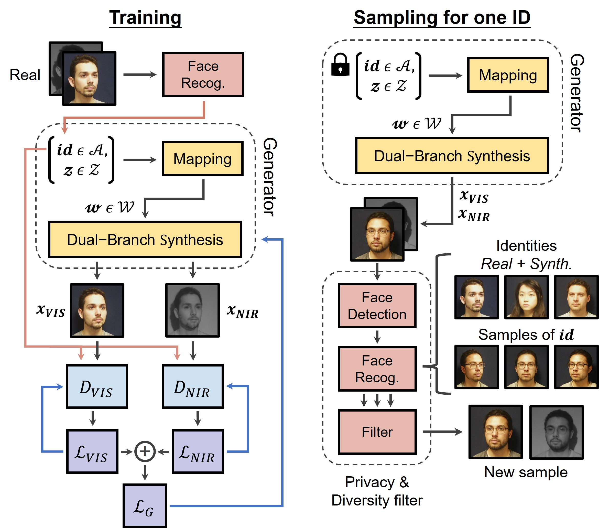

# ArcBiFaceGAN: Generating Bimodal Privacy-Preserving Data for Face Recognition

**ArcBiFaceGAN: Generating Bimodal Privacy-Preserving Data for Face Recognition**<br>
Darian Tomašević, Fadi Boutros, Naser Damer, Peter Peer, Vitomir Štruc<br>
LINK_TO_BE_ADDED<br>


 

Abstract : *The performance of state-of-the-art face recognition systems depends crucially on the availability of
large-scale training datasets. However, increasing privacy concerns nowadays accompany the collection
and distribution of biometric data, which already resulted in the retraction of valuable face recognition
datasets. The use of synthetic data represents a potential solution, however, the generation of privacy-preserving facial images useful for training recognition models is still an open problem. Generative methods
also remain bound to the visible spectrum, despite the benefits that multispectral data can provide. To
address these issues, we present a novel identity-conditioned generative framework capable of producing
large-scale recognition datasets of visible and near-infrared privacy-preserving face images. The framework
relies on a novel identity-conditioned dual-branch style-based generative adversarial network to enable the
synthesis of aligned high-quality samples of identities determined by features of a pretrained recognition
model. In addition, the framework incorporates a novel filter to prevent samples of privacy-breaching
identities from reaching the generated datasets and to also improve identity separability and intra-identity
diversity. Extensive experiments on six publicly available datasets reveal that our framework achieves
competitive synthesis capabilities while preserving the privacy of real-world subjects. The synthesized
datasets also facilitate training more powerful recognition models than datasets generated by competing
methods or even small-scale real-world datasets. Employing both visible and near-infrared data for training
also results in higher recognition accuracy on real-world visible spectrum benchmarks. Thus, training
with multispectral data could potentially improve existing recognition systems that utilize only the visible
spectrum, without the need for additional sensors.*

<!--p align="center">

</p--> 

---

## Release Notes: 

The ArcBiFaceGAN PyTorch framework allows for the generation of large-scale recognition datasets of visible and near-infrared privacy-preserving face images. 

The framework is made up of an identity-conditioned Dual-Branch StyleGAN2, based on the [StyleGAN2-ADA](https://github.com/NVlabs/stylegan2-ada-pytorch) implementation and an auxiliary Privacy and Diversity filter, based on the pre-trained [ArcFace recognition model](https://github.com/chenggongliang/arcface).

This repository follows the [Nvidia Source Code License](https://nvlabs.github.io/stylegan2-ada-pytorch/license.html).

---

## Requirements and Setup:

* Linux and Windows are supported, but we recommend Linux for performance and compatibility reasons.
* 1&ndash;8 high-end NVIDIA GPUs with at least 12 GB of memory. We have tested our implementation on a NVIDIA RTX 3060 GPU and a NVIDIA RTX 3090 GPU. Parallelization across multiple GPUs are also supported for training the DB-StyleGAN2 network.
* We highly recommend using Docker to setup the environment. Please use the [provided Dockerfile](./Dockerfile) to build an image with the required library dependencies. (The Docker image requires NVIDIA driver release `r455.23` or later.)
* Otherwise the requirements remain the same as in  [StyleGAN2-ADA](https://github.com/NVlabs/stylegan2-ada-pytorch). These being 64-bit Python 3.7, PyTorch 1.7.1, and CUDA toolkit 11.0 or later. Use at least version 11.1 if running on RTX 3090. Check the linked repository if you are having any problems.

How to build the Docker environment: 
```.bash
docker build --tag sg2ada:latest .
```

---

## Download links for the pretrained models:
You can use the following pretrained models to generate the synthetic data used in the research paper (i.e. skip to Step 4)
*  [identity conditioned StyleGAN2](https://unilj-my.sharepoint.com/:u:/g/personal/darian_tomasevic_fri1_uni-lj_si/ET2lpGwcIjlNhZEBnYxPDwYBgGcVl08rrXJvY4U3t3KWMg?e=Vjahfd)
*  [ArcFace recognition model](https://unilj-my.sharepoint.com/:u:/g/personal/darian_tomasevic_fri1_uni-lj_si/EfSmDfvsVlZEuOBqieDl4zEBJkTJ65aBnUtrC4q5nT2a-g?e=PBYj7o)

You can also train your own generative model as described below.

--- 

# How to run (using Docker): 
To train and run the ArcBiFaceGAN framework use the [`main_ArcBiFaceGAN.ipynb`](main_ArcBiFaceGAN.ipynb) Jupyter Notebook, or follow these steps:

## Step 1. Prepare the training dataset:

To prepare the dataset of face images follow the structure found in `DATASETS/example_dataset`. The dataset should contain a `VIS` directory with visible spectrum images, and a `NIR` directory with corresponding near-infrared images. 
Images should use the naming convention `{identity}_{sample_name}.jpg`. Corresponding images in the `VIS` and `NIR` directories should share the same name. 

---

## Step 2. Add identity features to the training dataset:

To create identity features of the training images use the script `create_training_identity_features.py`. The identity features are saved in the `identity_features.json` file in the dataset directory.

```.bash
./docker_run.sh python create_training_identity_features.py --data_folder="DATASETS/example_dataset" --rec_model={path_to_recognition_model}
```
The script relies on the following arguments: 
* `--rec_model` should point to the `.pth` file of a pretrained recognition model
* `--gpu_device_number` determines which GPU to use (e.g. `--gpu_device_number=0`)
*  `--all_or_one`  determines whether to use identity features of each image in the dataset (`all`) or one most representative identity feature per identity (`one`)

---

## Step 3. Train the identity-conditioned StyleGAN2 model:

To train the identity-conditioned StyleGAN2 of ArcBiFaceGAN use the `training.py` script as follows:   
```.bash
./docker_run.sh python training.py --data="DATASETS/example_dataset"  --outdir="EXPERIMENTS/training_output" --NIR_loss_weight=0.1 
 --cfg="auto" --snap=20 --batch=12 --mirror=1 --gpus=1 --gpu_device_number=0
```
The script relies on the following arguments: 
* `--data` should point to the training dataset with `VIS` and `NIR` subdirectories
* `--outdir` determines the output directory
* `--NIR_loss_weight` defines the weight of the NIR Discriminator in the final loss calculation
* `--cfg` determines the model configuration (e.g. number of blocks, image resolution)
* `--snap` defines the frequency of snapshots during training
* `--batch` determines the batch size
* `--mirror=1` enables horizontal flipping of training images
* `--gpu_device_number` determines which GPU to use, if you want to use one
* `--gpus` determines the amount of available GPUs, if you want to use multiple (only works in certain environments)
* `--cond=0` can be used to disable training based on the identity condition

To continue training from a saved checkpoint use the `--resume` argument, i.e. `--resume={path_to_pretrained_model}`. 

For details on other possible arguments and available configurations check the [StyleGAN2-ADA](https://github.com/NVlabs/stylegan2-ada-pytorch) documentation.

---

## Step 4. Generate synthetic recognition datasets: <br>

To generate data using ArcBiFaceGAN use the `generate_recognition_data.py` script as follows:
```.bash
./docker_run.sh python generate_recognition_data.py --gen_model={path_to_trained_gen_model}  --rec_model={path_to_recognition_model} --outdir="EXPERIMENTS/synthetic_output/example_dir" --training_ids="DATASETS/example_dataset/identity_features.json" --gpu_device_number=0 --ids=100 --samples_per_id=32 --seed=0
```
The script relies on the following arguments: 
* `--gen_model` should point to the `.pkl` file of the identity-conditioned StyleGAN2 model that was trained in the previous step
* `--rec_model` should point to the `.pth` file of the pretrained recognition model to be used for filtering
* `--training_ids` should point to the  `.json` file of training identity features (i.e. identities of real-world subjects)
*  `--outdir` determines the output directory
* `--ids` defines the amount of synthetic identities to be generated
* `--samples_per_id` controls the amount of samples to be generated per synthetic identity
* `--seed` determines which starting seed to use 
* `--truncation` controls the truncation factor of the latent space (see the [StyleGAN2-ADA](https://github.com/NVlabs/stylegan2-ada-pytorch) documentation)
*  `--gpu_device_number` determines which GPU device to use (e.g. `0` or `1`)

---

## License

Copyright &copy; 2021, NVIDIA Corporation. All rights reserved.

This work is made available under the [Nvidia Source Code License](https://nvlabs.github.io/stylegan2-ada-pytorch/license.html).

---

## Citation

If you use code or results from this repository, please cite the following publication:

```
To be added.
```

---

## Acknowledgements

Supported in parts by the Slovenian Research and Innovation Agency ARIS through the Research Programmes P2-0250(B) "Metrology and Biometric Systems" and P2--0214 (A) “Computer Vision”, the ARIS Project J2-2501(A) "DeepBeauty" and the ARIS Young Researcher Program.


